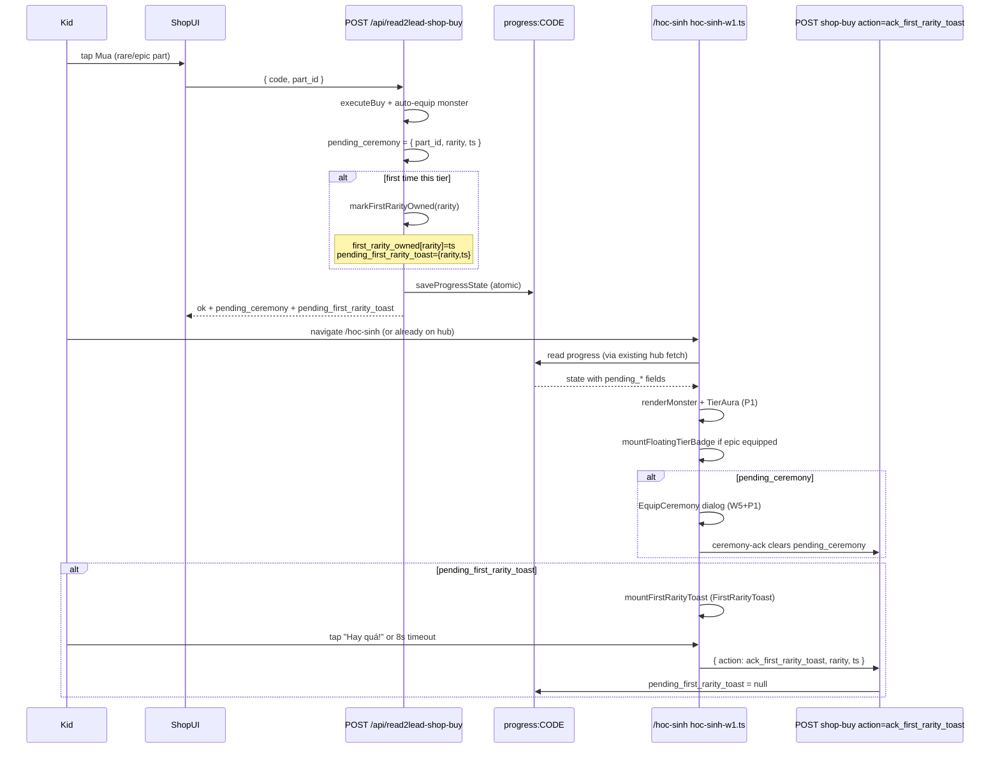

# V4 W6 Phase 2 — Detailed implementation spec (Codex)

**Parent:** `docs/V4_W6_RARITY_FEEL_SPEC.md` §4  
**Depends on:** W5 v2 merged (`avatar_stage` + `pending_ceremony` + `read2lead-ceremony-ack.js`) **and** W6 Phase 1 merged (`TierAura`, `r2l-w6-tiers.css`, rarity-scaled `EquipCeremony`)  
**Owner:** Codex · **Branch:** `codex/w6-rarity-feel-p2` (off `origin/main` after P1 merge)  
**Status:** READY — file-by-file spec for Cursor/Codex implement  
**Author:** Claude · **Date:** 2026-06-14

> Phase 2 adds **stateful first-rarity achievement**, **epic visual differentiation** (CSS filter + lightning overlay), **floating tier badge**, and **leaderboard name tint**. Pure additive state; no shop-list / quest / RP changes.

---

## 1. Pre-conditions

### 1.1 Merge order (hard gate)

| Gate | Requirement | Why |
|---|---|---|
| G0 | `origin/main` includes W5 v2 (`8531f49`+ or `codex/w5-v2-rank-egg` merged) | `avatar_stage`, `pending_ceremony`, shop auto-equip, ceremony-ack |
| G1 | W6 Phase 1 merged to `main` | `TierAura`, `--w6-*` tokens, `r2l-w6-audio.ts`, P1 tests green |
| G2 | Full suite green on P1 merge commit | P2 builds on P1 aura + ceremony duration |

**Do not start P2 until G0 + G1 pass.** P2 UI assumes P1 `TierAura` wraps hub monster slot and P1 tier CSS tokens exist.

### 1.2 W5 v2 state contract (read-only dependency)

P2 **reuses** the W5 v2 ceremony transport pattern; it does **not** replace it.

```js
// Already in KV after W5 v2 — P2 must not break these fields
avatar_stage: 'egg' | 'basic' | 'custom'
pending_ceremony: { part_id: string, rarity: 'rare'|'epic', ts: string } | null
```

- `pending_ceremony` = equip ceremony after shop buy (per-part, W5 v2 + W6 P1 duration scaling).
- P2 adds a **separate** transient field `pending_first_rarity_toast` (per-tier milestone, see §3). Equip ceremony and first-rarity toast can fire on the **same** buy (epic first buy → both).

### 1.3 Files allowed (exact — parent §4.2)

| # | File | Action |
|---|---|---|
| 1 | `functions/api/_read2lead-v2-state.js` | EDIT |
| 2 | `functions/api/submit-read2lead-lesson.js` | **NO CHANGE** |
| 3 | `functions/api/read2lead-shop-buy.js` | EDIT |
| 4 | `src/lib/monster-avatar.ts` | EDIT |
| 5 | `src/lib/r2l-particle-overlay.ts` | NEW |
| 6 | `src/components/read2lead/v4/FloatingTierBadge.astro` | NEW |
| 7 | `src/components/read2lead/v4/FirstRarityToast.astro` | NEW |
| 8 | `src/pages/hoc-sinh/hoc-sinh-w1.ts` | EDIT |
| 9 | `src/pages/read2lead/leaderboard.astro` | EDIT |
| 10 | `public/audio/kenney/lightning-bolt.mp3` | NEW (optional — skip if Kenney pack has no audio) |
| — | `tests/w6-first-rarity-owned.test.mjs` | NEW (test file — not in parent allowlist but required §7) |
| — | `tests/w6-particle-overlay.test.mjs` | NEW (test file — required §7) |

CẤM: scheduler/RP/shop-list, W2 quest/chest, `lesson.astro`, mic/speaking.

**Ack transport (within allowlist):** P2 clears `pending_first_rarity_toast` via a new `action: 'ack_first_rarity_toast'` branch in `read2lead-shop-buy.js` (same endpoint, separate code path). Do **not** edit `read2lead-ceremony-ack.js`.

---

## 2. Per-file change list

### 2.1 `functions/api/_read2lead-v2-state.js`

**Location:** near `normalizePendingCeremony` (~L668).

#### Add constants + normalizers (~35 lines)

```js
const FIRST_RARITY_TIERS = ['rare', 'epic', 'legendary'];

/** @returns {{ rare?: string, epic?: string, legendary?: string }} */
export function normalizeFirstRarityOwned(raw) {
  if (!raw || typeof raw !== 'object') return {};
  const out = {};
  for (const tier of FIRST_RARITY_TIERS) {
    const ts = raw[tier];
    if (typeof ts === 'string' && ts.trim()) out[tier] = ts.trim();
  }
  return out;
}

/** @returns {{ rarity: 'rare'|'epic', ts: string } | null} */
export function normalizePendingFirstRarityToast(raw) {
  if (!raw || typeof raw !== 'object') return null;
  const rarity = raw.rarity;
  if (!['rare', 'epic'].includes(rarity)) return null;
  const ts = String(raw.ts || '').trim();
  if (!ts) return null;
  return { rarity, ts };
}

/** First-time tier unlock — idempotent, never overwrites existing ts. */
export function markFirstRarityOwned(state, rarity, nowIso = new Date().toISOString()) {
  if (!['rare', 'epic', 'legendary'].includes(rarity)) return state;
  const owned = normalizeFirstRarityOwned(state.first_rarity_owned);
  if (owned[rarity]) return state;
  const nextOwned = { ...owned, [rarity]: nowIso };
  return {
    ...state,
    first_rarity_owned: nextOwned,
    pending_first_rarity_toast: { rarity, ts: nowIso },
  };
}

export function clearPendingFirstRarityToast(state, payload = {}) {
  const pending = normalizePendingFirstRarityToast(state.pending_first_rarity_toast);
  if (!pending) return state;
  const rarity = String(payload.rarity || '').trim();
  const ts = String(payload.ts || '').trim();
  const matches = (!rarity || pending.rarity === rarity) && (!ts || pending.ts === ts);
  if (!matches) return state;
  return { ...state, pending_first_rarity_toast: null };
}
```

#### Wire into `normalizeProgressState` base object (~L763, after `pending_ceremony`)

```js
first_rarity_owned: normalizeFirstRarityOwned(raw?.first_rarity_owned),
pending_first_rarity_toast: normalizePendingFirstRarityToast(raw?.pending_first_rarity_toast),
```

**Migration rule:** if `raw.first_rarity_owned` missing → `{}`. **Never** infer from `unlocked_parts` or purchase history (§4).

#### Wire into `publicProgressState` (~L1362, after `pending_ceremony`)

```js
first_rarity_owned: normalizeFirstRarityOwned(state.first_rarity_owned),
pending_first_rarity_toast: normalizePendingFirstRarityToast(state.pending_first_rarity_toast),
```

#### Export

Add `normalizeFirstRarityOwned`, `normalizePendingFirstRarityToast`, `markFirstRarityOwned`, `clearPendingFirstRarityToast` to module exports (for shop-buy + tests).

---

### 2.2 `functions/api/submit-read2lead-lesson.js`

**NO CHANGE.** First-rarity detection happens only in `read2lead-shop-buy.js`. Document in PR description to avoid drive-by edits.

---

### 2.3 `functions/api/read2lead-shop-buy.js`

#### Import additions (top)

```js
import {
  // ...existing...
  markFirstRarityOwned,
  clearPendingFirstRarityToast,
} from './_read2lead-v2-state.js';
```

#### New early branch — ack handler (~L34, after accessCode parse)

```js
if (body.action === 'ack_first_rarity_toast') {
  // same rate-limit + code lookup as buy
  const state = await loadProgressState(env, accessCode, codeData);
  const cleared = clearPendingFirstRarityToast(state, {
    rarity: body.rarity,
    ts: body.ts,
  });
  if (cleared !== state) {
    await saveProgressState(env, accessCode, cleared);
  }
  return json({ ok: true, cleared: cleared !== state });
}
```

#### Buy path — after `executeBuy` success (~L88, before `saveProgressState`)

```js
const nowIso = new Date().toISOString();
let nextState = {
  ...result.state,
  avatar_stage: 'custom',
  avatar: { /* existing monster merge */ },
  pending_ceremony: { part_id: partId, rarity, ts: nowIso },
};

// First-rarity milestone (independent of pending_ceremony)
if (rarity === 'rare' || rarity === 'epic') {
  nextState = markFirstRarityOwned(nextState, rarity, nowIso);
}

const saved = await saveProgressState(env, accessCode, nextState);
```

#### Response JSON — additive fields

```js
return json({
  ok: true,
  // ...existing...
  pending_ceremony: saved.pending_ceremony,
  first_rarity_owned: saved.first_rarity_owned,
  pending_first_rarity_toast: saved.pending_first_rarity_toast,
});
```

**Race safety:** `markFirstRarityOwned` only sets `pending_first_rarity_toast` when tier key was absent **before** write. Re-buy same tier → no new toast.

---

### 2.4 `src/lib/monster-avatar.ts`

#### New exports (~after L51 `MonsterRenderOpts`)

```ts
import { getPartRarity, type PartRarity } from './avatar-rarity';

export const EPIC_PART_FILTER = 'hue-rotate(15deg) saturate(1.25)';

export type MonsterRenderOpts = {
  // ...existing...
  /** Apply epic hue-shift on non-body equipped parts. Default true. */
  applyEpicTierFilter?: boolean;
  /** Attach Kenney lightning on epic horn/antenna detail parts. Default true. */
  attachEpicParticleOverlay?: boolean;
};

const OVERLAY_PART_RE = /horn|antenna/i;

export function highestEquippedRarity(
  config: MonsterConfig,
): PartRarity {
  const tiers: PartRarity[] = ['common', 'rare', 'epic'];
  let best = 0;
  for (const slot of MONSTER_SLOTS) {
    const id = String(config[slot as MonsterSlot] || '').trim();
    if (!id || id === 'default') continue;
    const r = getPartRarity(id);
    const idx = tiers.indexOf(r);
    if (idx > best) best = idx;
  }
  return tiers[best] || 'common';
}

function tierFilterForPart(partId: string, applyFilter: boolean): string | undefined {
  if (!applyFilter || getPartRarity(partId) !== 'epic') return undefined;
  return EPIC_PART_FILTER;
}
```

#### Change `renderPartLayer` (~L322)

Add optional `extraFilter?: string` param; when set, **append** to existing body filter:

```ts
if (extraFilter) {
  img.style.filter = [img.style.filter, extraFilter].filter(Boolean).join(' ');
}
```

Pass `tierFilterForPart(partId, opts.applyEpicTierFilter !== false)` for slots `eyes`, `mouth`, `arms`, `detail` (not `body` — body keeps `bodyColorFilter` only).

#### Change `renderMonster` (~L431)

After each `renderPartLayer` / `renderArmsLayers`, if `opts.attachEpicParticleOverlay !== false` and slot is `detail`:

```ts
import { attachLightningOverlay } from './r2l-particle-overlay';

// inside render path, after detail layer appended:
if (slot === 'detail' && OVERLAY_PART_RE.test(partId) && getPartRarity(partId) === 'epic') {
  const layer = stack.querySelector(`[data-slot="detail"]`) as HTMLElement | null;
  if (layer) attachLightningOverlay(layer, { size: opts.size || 'large' });
}
```

Refactor: have `renderPartLayer` return the layer `HTMLElement | null` instead of `boolean` (or query stack after render).

---

### 2.5 `src/lib/r2l-particle-overlay.ts` (NEW, ≤80 lines)

```ts
export type ParticleOverlaySize = 'large' | 'small';

export type OverlayAnchor = {
  topPct: number;
  leftPct: number;
  widthPct: number;
  heightPct: number;
};

const LIGHTNING_SRC = '/assets/particles/kenney/lightning_01.png';

/** Horn/antenna epic parts — anchor bolt above part bounding box. */
export function overlayAnchorForDetail(partId: string, size: ParticleOverlaySize): OverlayAnchor {
  const compact = size === 'small';
  return {
    topPct: compact ? -18 : -22,
    leftPct: 42,
    widthPct: compact ? 28 : 22,
    heightPct: compact ? 36 : 40,
  };
}

export function attachLightningOverlay(
  partLayer: HTMLElement,
  opts: { size?: ParticleOverlaySize; partId?: string } = {},
): HTMLImageElement | null {
  if (typeof document === 'undefined') return null;
  if (partLayer.querySelector('[data-r2l-lightning-overlay]')) return null;

  const size = opts.size || 'large';
  const anchor = overlayAnchorForDetail(opts.partId || '', size);
  const bolt = document.createElement('img');
  bolt.src = LIGHTNING_SRC;
  bolt.alt = '';
  bolt.draggable = false;
  bolt.loading = 'lazy';
  bolt.decoding = 'async';
  bolt.dataset.r2lLightningOverlay = '1';
  bolt.className = 'r2l-lightning-overlay';
  bolt.style.cssText = `
    position:absolute;
    top:${anchor.topPct}%;
    left:${anchor.leftPct}%;
    width:${anchor.widthPct}%;
    height:${anchor.heightPct}%;
    pointer-events:none;
    z-index:4;
    image-rendering:pixelated;
    animation:r2l-lightning-flicker 1.2s ease-in-out infinite;
  `;
  partLayer.style.position = 'relative';
  partLayer.appendChild(bolt);
  injectLightningKeyframes();
  return bolt;
}

function injectLightningKeyframes() { /* id=r2l-lightning-keyframes, prefers-reduced-motion: animation none */ }
```

**Asset:** Codex copies `lightning_01.png` (or closest bolt sprite) from [Kenney Particle Pack](https://kenney.nl/assets/particle-pack) → `public/assets/particles/kenney/lightning_01.png`. Credit in existing `CREDITS.md` if present.

**Optional audio:** `public/audio/kenney/lightning-bolt.mp3` — play from `FirstRarityToast` on epic only; skip file if not in pack.

---

### 2.6 `src/components/read2lead/v4/FloatingTierBadge.astro` (NEW)

```astro
---
export interface Props {
  tier: 'common' | 'rare' | 'epic' | 'legendary';
}

const { tier = 'common' } = Astro.props;

const LABELS: Record<string, string> = {
  rare: '✨ Hiếm',
  epic: '✨ Sử Thi',
  legendary: '✨ Huyền Thoại',
};

const label = LABELS[tier] || '';
const show = tier === 'epic' || tier === 'legendary';
---

{show && (
  <span class="r2l-floating-tier-badge" data-tier={tier} aria-label={label}>
    {label}
  </span>
)}

<style is:global>
  .r2l-floating-tier-badge {
    position: absolute;
    top: 0.15rem;
    right: 0.15rem;
    z-index: 6;
    padding: 0.2rem 0.45rem;
    border-radius: 999px;
    font-size: 0.65rem;
    font-weight: 800;
    line-height: 1.2;
    color: #fffdf4;
    background: rgb(168 85 247 / 0.92);
    border: 1.5px solid #e9d5ff;
    box-shadow: 0 2px 8px rgb(168 85 247 / 0.45);
    pointer-events: none;
  }
  .r2l-floating-tier-badge[data-tier='legendary'] {
    background: linear-gradient(90deg, #fbbf24, #f59e0b);
    border-color: #fde68a;
  }
  @media (prefers-reduced-motion: reduce) {
    .r2l-floating-tier-badge { box-shadow: none; }
  }
</style>
```

**Mount rule:** only when `highestEquippedRarity(monster) === 'epic'` (or legendary in Phase 3). Rare alone → no floating badge (P2 scope).

---

### 2.7 `src/components/read2lead/v4/FirstRarityToast.astro` (NEW)

```astro
---
export interface Props {
  rarity: 'rare' | 'epic';
}

const { rarity } = Astro.props;

const COPY: Record<string, { title: string; body: string }> = {
  rare: {
    title: 'Lần đầu sở hữu Hiếm ✨',
    body: 'Con vừa mở khóa phần Hiếm đầu tiên. Giỏi lắm!',
  },
  epic: {
    title: 'Lần đầu sở hữu Sử Thi 💎',
    body: 'Con vừa mở khóa phần Sử Thi đầu tiên. Thật đặc biệt!',
  },
};
const copy = COPY[rarity] || COPY.rare;
---

<div
  class="r2l-first-rarity-toast"
  role="status"
  aria-live="polite"
  data-rarity={rarity}
  hidden
>
  <p class="r2l-first-rarity-toast__title">{copy.title}</p>
  <p class="r2l-first-rarity-toast__body">{copy.body}</p>
  <button type="button" class="r2l-kid-btn r2l-kid-btn--primary r2l-kid-btn--md" data-first-rarity-dismiss>
    Hay quá!
  </button>
</div>

<style is:global>
  .r2l-first-rarity-toast {
    position: fixed;
    inset: auto 1rem 5.5rem 1rem;
    z-index: 90;
    max-width: 22rem;
    margin: 0 auto;
    padding: 1rem 1.1rem;
    border-radius: 1.25rem;
    border: 2px solid var(--w6-rare, #3b82f6);
    background: #0f172a;
    color: #fffdf4;
    text-align: center;
    box-shadow: 0 12px 32px rgb(0 0 0 / 0.35);
  }
  .r2l-first-rarity-toast[data-rarity='epic'] {
    border-color: var(--w6-epic, #a855f7);
    box-shadow: 0 0 28px rgb(168 85 247 / 0.4);
  }
  .r2l-first-rarity-toast:not([hidden]) {
    animation: r2l-toast-rise 0.35s ease-out both;
  }
  .r2l-first-rarity-toast__title {
    margin: 0 0 0.35rem;
    font-size: 1.05rem;
    font-weight: 800;
  }
  .r2l-first-rarity-toast__body {
    margin: 0 0 0.85rem;
    font-size: 0.9rem;
    opacity: 0.92;
  }
  @media (prefers-reduced-motion: reduce) {
    .r2l-first-rarity-toast:not([hidden]) { animation: none; }
  }
</style>
```

**Client mount:** `hoc-sinh-w1.ts` clones template from hidden host in page layout OR builds equivalent DOM in TS (prefer importing markup string from a tiny `first-rarity-toast.ts` helper if Astro static import is awkward — acceptable: duplicate minimal HTML in TS ≤15 lines).

**Minny voice:** 1–2 câu, tiếng Việt, khen effort không khen rank, no red/FOMO.

---

### 2.8 `src/pages/hoc-sinh/hoc-sinh-w1.ts`

#### Imports (~L1)

```ts
import FloatingTierBadge from '../../components/read2lead/v4/FloatingTierBadge.astro'; // if supported
import { highestEquippedRarity } from '../../lib/monster-avatar';
import { playW6TierStinger } from '../../lib/r2l-w6-audio'; // P1 dependency
```

If Astro component import fails in TS bundle, inline badge DOM in `mountFloatingTierBadge()`.

#### Page layout — ensure toast host exists

In `hoc-sinh.astro` (if already imports EquipCeremony): add `<FirstRarityToast rarity="rare" />` hidden shells OR single `[data-r2l-first-rarity-host]`. **If `hoc-sinh.astro` not in allowlist:** inject host via `dash.innerHTML` suffix:

```html
<div data-r2l-first-rarity-host class="hidden" aria-hidden="true"></div>
```

#### Update `renderHubMonster` (~L467)

```ts
function renderHubMonster(slot: HTMLElement, state: Record<string, unknown>) {
  // ...existing renderMonster call with new opts:
  renderMonster(slot, renderConfig, {
    size: 'large',
    withCosmetics: true,
    equipped: state.equipped as Record<string, string>,
    equippedDisplay: state.equipped_display as EquippedDisplayItem[],
    applyEpicTierFilter: true,
    attachEpicParticleOverlay: true,
  });
  mountFloatingTierBadge(slot, renderConfig);
  // ...existing detail strip
}

function mountFloatingTierBadge(slot: HTMLElement, monster: MonsterConfig) {
  slot.querySelector('.r2l-floating-tier-badge')?.remove();
  const tier = highestEquippedRarity(monster);
  if (tier !== 'epic' && tier !== 'legendary') return;
  slot.style.position = 'relative';
  const badge = document.createElement('span');
  badge.className = 'r2l-floating-tier-badge';
  badge.dataset.tier = tier;
  badge.setAttribute('aria-label', tier === 'epic' ? '✨ Sử Thi' : '✨ Huyền Thoại');
  badge.textContent = tier === 'epic' ? '✨ Sử Thi' : '✨ Huyền Thoại';
  slot.appendChild(badge);
}
```

Wrap monster slot with P1 `TierAura` if not already (P1 should have done this — P2 only adds badge **inside** `data-hub-monster`).

#### New `mountFirstRarityToast` — call at end of `renderHook` (~L433)

```ts
function mountFirstRarityToast(
  code: string,
  state: Record<string, unknown>,
) {
  const pending = state.pending_first_rarity_toast as
    | { rarity: 'rare' | 'epic'; ts: string }
    | null
    | undefined;
  if (!pending?.rarity || !pending.ts) return;

  const host = document.querySelector('[data-r2l-first-rarity-host]') as HTMLElement | null;
  if (!host) return;

  // Build toast DOM (match FirstRarityToast.astro)
  host.innerHTML = `...`;
  host.classList.remove('hidden');
  const toast = host.querySelector('.r2l-first-rarity-toast') as HTMLElement;
  toast?.removeAttribute('hidden');

  void playW6TierStinger(pending.rarity); // P1 audio map

  const dismiss = async () => {
    host.classList.add('hidden');
    host.innerHTML = '';
    await fetch('/api/read2lead-shop-buy', {
      method: 'POST',
      headers: { 'Content-Type': 'application/json' },
      body: JSON.stringify({
        code,
        action: 'ack_first_rarity_toast',
        rarity: pending.rarity,
        ts: pending.ts,
      }),
    }).catch(() => {});
  };

  host.querySelector('[data-first-rarity-dismiss]')?.addEventListener('click', dismiss, { once: true });
  window.setTimeout(dismiss, 8000); // auto-dismiss kid-friendly
}
```

Call: `mountFirstRarityToast(code, read2LeadState);` after monster render in `renderHook`.

**Coexistence with `pending_ceremony`:** Equip ceremony (MonsterBuilder or shop return) runs first; toast mounts after hub paint (z-index 90 > dialog backdrop). Both can show sequentially — toast after ceremony closes if overlap, OR toast immediately if `avatar_stage !== 'custom'` (buy from shop page then navigate).

---

### 2.9 `src/pages/read2lead/leaderboard.astro`

#### Import in `<script>` block

```js
import { getPartRarity } from '../../lib/avatar-rarity.ts';
```

#### Add helper (~before `podiumCard`)

```js
const TIER_NAME_COLOR = {
  rare: 'var(--w6-rare, #3b82f6)',
  epic: 'var(--w6-epic, #a855f7)',
  legendary: 'var(--w6-legendary, #fbbf24)',
};

function highestEquippedRarityFromMonster(monster) {
  if (!monster || typeof monster !== 'object') return 'common';
  const slots = ['body', 'eyes', 'mouth', 'arms', 'detail'];
  const order = { common: 0, rare: 1, epic: 2, legendary: 3 };
  let best = 'common';
  for (const slot of slots) {
    const id = String(monster[slot] || '').trim();
    if (!id) continue;
    const r = getPartRarity(id);
    if ((order[r] ?? 0) > (order[best] ?? 0)) best = r;
  }
  return best;
}

function leaderNameStyle(leader) {
  const tier = highestEquippedRarityFromMonster(leader.avatar?.monster);
  const color = TIER_NAME_COLOR[tier];
  return color && tier !== 'common' ? `style="color:${color}"` : '';
}
```

#### Apply to name `<h3>` in `podiumCard` (~L297) and `listRow` (~L327)

```html
<h3 class="text-3xl ${titleFont} leading-snug" ${leaderNameStyle(leader)}>${escapeHtml(leader.display_name)}</h3>
```

**Scope:** text color only (Gate G5 — no background pill). Egg-stage leaders keep default ink color.

#### Optional: pass tier filter to `renderMonster` in `mountLeaderMonsters`

```js
renderMonster(slot, leader.avatar.monster, {
  size: 'small',
  withCosmetics: true,
  equipped: leader.equipped,
  equippedDisplay: leader.equipped_display,
  compactCosmetics: true,
  applyEpicTierFilter: true,
  attachEpicParticleOverlay: false, // keep leaderboard rows compact
});
```

---

### 2.10 `public/audio/kenney/lightning-bolt.mp3` (optional NEW)

- Download only if Kenney Particle Pack ships a lightning SFX; else omit file and skip audio in toast.
- Do not add new npm deps.

---

## 3. State schema diff

### 3.1 Additive KV fields (on `progress:<CODE>`)

```ts
// Permanent — never deleted on rank change
first_rarity_owned: {
  rare?: string;      // ISO-8601 UTC ts, first rare shop buy
  epic?: string;      // ISO-8601 UTC ts, first epic shop buy
  legendary?: string; // reserved Phase 3 — normalizer accepts, P2 never sets
}

// Transient — mirrors pending_ceremony lifecycle
pending_first_rarity_toast: {
  rarity: 'rare' | 'epic';
  ts: string;         // matches first_rarity_owned[rarity] at unlock time
} | null
```

### 3.2 Diff vs W5 v2 + W6 P1

| Field | W5 v2 | W6 P1 | W6 P2 |
|---|---|---|---|
| `avatar_stage` | ✓ | read | read |
| `pending_ceremony` | ✓ | duration UI | read + unchanged |
| `first_rarity_owned` | — | — | **NEW** |
| `pending_first_rarity_toast` | — | — | **NEW** |

### 3.3 `publicProgressState` exposure

Both fields exposed to client (required for toast mount). `first_rarity_owned` is read-only display/history; client must not mutate it.

---

## 4. Migration

```js
// normalizeProgressState — when raw.first_rarity_owned absent:
first_rarity_owned: normalizeFirstRarityOwned(raw?.first_rarity_owned), // → {}

// when raw.pending_first_rarity_toast absent:
pending_first_rarity_toast: normalizePendingFirstRarityToast(raw?.pending_first_rarity_toast), // → null
```

| Rule | Behavior |
|---|---|
| Existing kids with `unlocked_parts` containing rare/epic | **Do NOT** backfill `first_rarity_owned` from history |
| Kid buys **new** rare/epic after deploy | `markFirstRarityOwned` fires even if they owned other tiers before |
| Kid already had epic, buys **first** rare | Sets `first_rarity_owned.rare` only |
| Re-buy / duplicate part | `executeBuy` fails `already_owned` — no toast |
| Admin / test `reset_state` wipes KV | Normalizer returns `{}` / `null`; achievements reset (acceptable test-only) |

---

## 5. Ceremony + toast flow



**Ordering:** `pending_ceremony` equip dialog and `pending_first_rarity_toast` may both be set on one buy. Implementation: play equip ceremony first (if MonsterBuilder mounts); show first-rarity toast after ceremony closes (`setTimeout` chain) OR immediately on hub if no builder (stage `basic` → `custom` first buy).

---

## 6. Edge cases

| # | Scenario | Expected behavior |
|---|---|---|
| E1 | **Two simultaneous buys** (two tabs, same kid, two different first tiers) | KV last-write-wins per `saveProgressState`. Each tier key in `first_rarity_owned` written at most once (`markFirstRarityOwned` idempotent). Worst case: one `pending_first_rarity_toast` overwritten — kid still keeps both `first_rarity_owned` keys; may see one toast (acceptable). |
| E2 | **Two simultaneous buys same tier** (double-click Mua) | Second request `already_owned` 400 OR idempotent no-op; `first_rarity_owned.rare` set once. |
| E3 | **`reset_state` / admin KV wipe** | `first_rarity_owned → {}`, `pending_first_rarity_toast → null`. Kid can re-earn toasts (test env only). Prod admin reset rare. |
| E4 | **Kid downgrades rank** (theoretical; RP never decreases prod) | `first_rarity_owned` **never revoked**. `avatar_stage` may revert egg per W5 v2 rules but purchases / milestones stay. |
| E5 | **Grandfather kid owns epic before P2 deploy** | No backfill → no retroactive toast. Epic filter + overlay apply immediately on render. Next **new** tier buy still triggers toast. |
| E6 | **`pending_first_rarity_toast` stuck** (kid dismisses offline) | Toast auto-dismiss at 8s still fires ack. Re-login: if ack failed, toast shows again until ack succeeds. |
| E7 | **Epic horn not in `detail` slot** | Overlay only when `detail` part id matches `/horn|antenna/i` and `rarity === 'epic'`. Other epic parts get filter only. |
| E8 | **`prefers-reduced-motion`** | Lightning animation off; toast rise animation off; badge static. |
| E9 | **Common part buy** | No `first_rarity_owned` change; no toast. |
| E10 | **Shop buy + hub open** | Response includes `pending_first_rarity_toast`; if shop page listens, may show toast there too — **hub only** for P2 (avoid duplicate: shop page does not mount toast). |

---

## 7. Test plan (≥6 tests, 2 files)

### 7.1 `tests/w6-first-rarity-owned.test.mjs` (≥4 tests)

Import from `_read2lead-v2-state.js` and exercise shop-buy handler with mock env (pattern: `read2lead-shop-buy.test.mjs`).

| # | Test name | Assert |
|---|---|---|
| T1 | `normalizeFirstRarityOwned empty raw → {}` | `{}` |
| T2 | `normalizeFirstRarityOwned strips invalid keys` | only rare/epic/legendary string ts kept |
| T3 | `markFirstRarityOwned first rare sets owned + pending` | `owned.rare` ISO string; `pending.rarity === 'rare'` |
| T4 | `markFirstRarityOwned second call idempotent` | same ts; no new pending if tier exists |
| T5 | `shop-buy epic first time sets first_rarity_owned.epic` | integration mock KV |
| T6 | `ack_first_rarity_toast clears pending only when ts matches` | `cleared: true` |
| T7 | `normalizeProgressState migration missing field → {}` | old raw without field |

(Choose ≥6 from T1–T7.)

### 7.2 `tests/w6-particle-overlay.test.mjs` (≥3 tests)

| # | Test name | Assert |
|---|---|---|
| P1 | `overlayAnchorForDetail returns stable percents for horn` | topPct negative (above part) |
| P2 | `attachLightningOverlay creates img[data-r2l-lightning-overlay]` | single bolt, correct src path |
| P3 | `attachLightningOverlay idempotent` | second call does not duplicate |
| P4 | `highestEquippedRarity epic detail wins over rare arms` | returns `'epic'` |
| P5 | `EPIC_PART_FILTER applied in renderMonster` | source scan or jsdom: epic detail img style includes `hue-rotate(15deg)` |

(Choose ≥3 from P1–P5; total suite ≥6 across both files.)

### 7.3 Commands

```bash
node --test tests/w6-first-rarity-owned.test.mjs tests/w6-particle-overlay.test.mjs
node --test   # full suite must stay green (496+)
npx astro check  # no NEW errors
```

---

## 8. Done when (P2)

1. `first_rarity_owned` + `pending_first_rarity_toast` normalized, migrated default `{}` / `null`.
2. First rare/epic shop buy sets owned + pending; toast shows on hub; ack clears pending.
3. Epic parts render with `hue-rotate(15deg) saturate(1.25)`; horn/antenna epic has lightning overlay.
4. `FloatingTierBadge` "✨ Sử Thi" when epic equipped on hub portrait.
5. Leaderboard display name tinted by highest equipped tier (subtle text color).
6. Tests ≥6 across 2 files green; full suite green.
7. Branch `codex/w6-rarity-feel-p2` pushed; AGENT_LOG START + DONE with hash.

---

## 9. Out of scope (defer Phase 3)

- `legendary` tier parts + `first_rarity_owned.legendary` population
- Leaderboard background pills / flashy badges
- Backfill achievements from `unlocked_parts` history
- Editing `read2lead-ceremony-ack.js` (use shop-buy ack branch instead)
- `submit-read2lead-lesson.js` hooks

---

## 10. Reference — current code anchors

| Concern | File:line (main @ a231a1a) |
|---|---|
| `normalizePendingCeremony` pattern | `_read2lead-v2-state.js:668` |
| `publicProgressState` | `_read2lead-v2-state.js:1315` |
| Shop buy + `pending_ceremony` | `read2lead-shop-buy.js:89` |
| Hub monster render | `hoc-sinh-w1.ts:467` |
| Leaderboard name row | `leaderboard.astro:327` |
| Epic horn manifest id | `monster-parts.json` `png-default-detail-blue-horn-large` |
